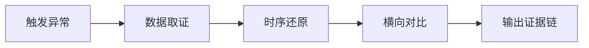

# 根因调试工作流（GStack Investigate × 运营适配版）

> 借鉴 Garry Tan GStack /investigate 的系统性根因调试方法论。
> 铁律：没有根因分析就没有修复。

---

## 核心原则

**Iron Law（铁律）**：在找到根因之前，不要输出任何"建议修复"或"应对措施"。

**/freeze（范围锁定）**：一次只调查一个问题，不要在调查A问题中发散到B问题。

**3次失效停止**：如果连续3次假设都被证伪，暂停调查并标记为🔴需要人类介入。

---

## 四个阶段

### 阶段一：调查（Investigate）—— 收集证据

> **目标**：获取原始数据，不得带有"结论倾向"地筛选



**操作清单：**

1. **取原始数据**
   - 从数据源读取（不是从记忆/推测）
   - 记录：数据源名称、读取时间、数据量
   - ✅ 从客流CSV实际读取数值
   - ❌ "我记得上周散客占比是..."

2. **还原时间线**
   - 异常的起点和终点是什么？
   - 之前3天的基线是什么？
   - 之后3天是否恢复？
   - 示例：5/13散客24.0% → 5/14 18.4% → 5/15 24.1%。起点5/13，持续3日未恢复。

3. **横向对比**
   - 同期竞品的数据如何？（排除行业性波动）
   - 这个异常在历史同期是否有先例？

4. **输出证据链**
   ```
   异常现象：[描述]
   数据来源：[具体数据源]
   时间窗口：[起始-结束]
   量化幅度：[与基线的差距%]
   竞品对比：[同频/异频]
   ```

---

### 阶段二：分析（Analyze）—— 提出假设

> **目标**：提出所有合理的根因假设，不得遗漏

**假设生成框：**

| 维度 | 典型问题 | 示例 |
|:----:|---------|------|
| 渠道层 | 是否有研学/大客户/旅行社集中出团？ | 5/13研学1,618人→压仓效应 |
| 内容层 | 是否有内容断更/竞品爆款压制？ | 内容真空第13天 |
| 天气层 | 天气是否影响出行？ | 降雨/高温/重度污染 |
| 竞品层 | 是否有竞品重磅活动分流？ | 清园杨洋空降搜308K |
| 产品层 | 园区内是否有特殊情况？ | 设备检修/活动取消 |
| 数据层 | 数据采集是否有问题？ | 抖音Cookie过期导致数据失真 |

**假设格式：**
```
假设A：[具体机制描述]
支持证据：[已确认的证据]
需要验证：[还需要什么数据来证实或证伪]
置信度：🟢高 / 🟡中 / 🔴低（标注当前）
```

---

### 阶段三：假设验证（Hypothesize）—— 逐一证伪

> **目标**：用数据验证或证伪每个假设，直到剩下最有解释力的一个

**验证方法：**

| 数据类型 | 验证方式 | 示例 |
|---------|---------|------|
| 结构化数据 | 统计对比 | 对比有研学日vs无研学日的散客占比 |
| 搜索趋势 | 曲线叠加 | 叠加竞品搜索指数看是否有跷跷板效应 |
| 历史回测 | 相同条件的历史表现 | 去年同期是否有同样模式 |

**验证格式：**
```
验证假设A：[假设描述]
证据1：[数据] → [结论] → 支持/反对/不确定
证据2：[数据] → [结论] → 支持/反对/不确定
综合判断：[该假设是否成立]
剩余不确定性：[如果有，标注]
```

---

### 阶段四：实施（Implement）—— 输出行动

> **目标**：基于根因输出可执行的最小修复方案

**输出模板：**
```
## 根因调查结论

根因：[一句话描述]
置信度：[1-10，10为最高]
证据链：[链接回阶段一的证据]

## 建议行动

建议动作：[最小可执行动作]
预期效果：[动作的预期影响]
验证方式：[如何判断修复是否有效]
替代方案：[如果主方案无效的备选]
不做的代价：[1句话说明忽略的后果]
```

---

## 实际案例：5/13-5/15散客占比危机

### 阶段一：调查
```
异常现象：散客占比连续跌破阈值（24.0%→18.4%→24.1%）
数据来源：2026游客量统计.csv（最后更新05-05）
时间窗口：5月13日-5月15日
量化幅度：从W19均值~35%跌至~22%，跌幅37%
竞品对比：清园搜索提升308K≠客流动因（IP事件属性）
```

### 阶段二：分析
```
假设A：研学集中出团压仓效应
支持证据：5/13研学1,618人 / 5/14研学1,927人
需要验证：去掉研学后散客绝对数是否仍然异常
置信度：🟢高

假设B：内容真空导致散客衰减
支持证据：5/5起内容真空第13天
需要验证：同期内容正常时散客数据做对比
置信度：🟡中

假设C：天气影响
支持证据：5/13-5/15有少量降雨
需要验证：降雨量与散客数据的相关度
置信度：🔴低
```

### 阶段三：验证
```
验证假设A（研学压仓）：
证据1：5/13总客流2,846人，研学1,618人→散客仅592人→支持
证据2：5/14总客流3,096人，研学1,927人→散客仅571人→支持
证据3：去掉研学后散客592/571与W19非研学日的~800-1000相比仍有下滑→假设A成立但需嵌套假设B
综合判断：✅ 核心根因成立，但渠道掩盖效应叠加内容真空
剩余不确定性：内容真空对散客的独立影响需要更长时间线确认
```

### 阶段四：实施
```
根因：研学集中出团（日均1,618-1,927人）压仓效应+内容真空（5/5起第13天）叠加
置信度：8/10
证据链：见阶段一→三

建议动作：启动散客专项内容投放（520档期最低方案）
预期效果：散客占比较复到>30%
验证方式：投放后3个工作日散客占比数据
替代方案：如内容投放无效→检查渠道依赖惯性是否已形成
不做的代价：散客生态进一步萎缩，恢复难度指数增长
```

---

## 与现有工作流的融合

| 触发场景 | 使用阶段 | 输出到 |
|---------|---------|-------|
| 数据异常分析（抖音指数异常跌/客流突变） | 全4阶段 | 日复盘/周报告 |
| 规则验证失败 | 阶段二→三 | 验证记录（补充假设验证部分） |
| 策略效果归因 | 阶段一→二→四 | 归因结论 |
| 每周复盘需要追溯根因 | 阶段一→三→四 | 周度复盘报告 |

---

*创建日期：2026-05-19 | 来源：Garry Tan GStack /investigate skill v1.0*
